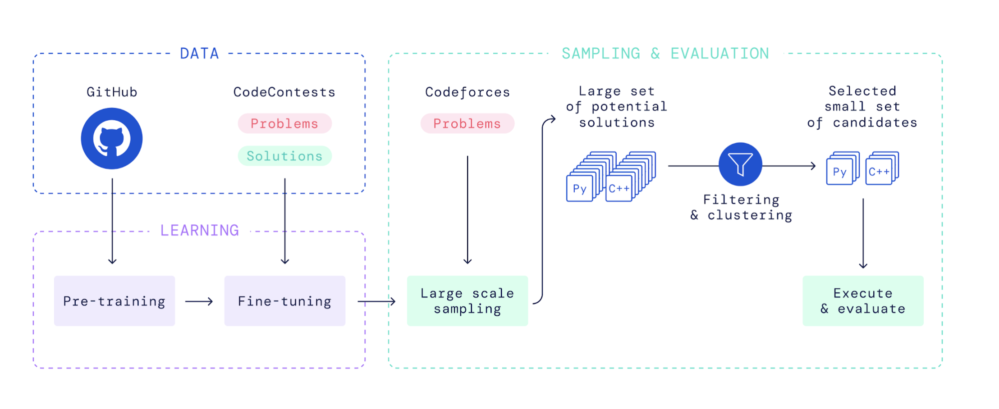

# Iteration 0. Hypotheses

_03-09-2025_

## Goal

Decide the best hypotheses to test. Account for implementation time, cost, parallelism, and problems.

## Motivation
5 days to poster. Need 1 day writeup, 2 days tinkering. Also days for 224N project -> Must concetrate 1-2 bets.

## Hypotheses

- No CoT. Even o3 not reliable. Do off-policy rounds. Eventually CoT by negative sampling, if need SFT distillation. (solved: edit CoT ok)
- Distil base -> (CoT) Posttrain ST -> (Augment) Posttrain RL -> Test RL -> Test Inference

### SFT Reasoning CoT

**Blabbering**
> We can run rejection sampling on a large teacher model like R1 on fast Groq inference.

Usually so long it overflows context window or close, huge KV cache to do gen & GRPO. Probably not in my budget, or feasible for stability (path dependence compounds over thinking steps) except with many training updates.
- 16K tokens for 1.5B is too much, to start.

Over a long thinking context, teacher model might try many ($k$) ideas, most will be clearly wrong and very dumb. 

- **Test Results**: For example, `DeepSeek-R1-Llama-70B` was counting the color numbers and summing them over a row. 
- Then I had to explicitly prompt it against summing colors because that operation is not valid (i.e. if 5 = green, 3 = blue, then 5 + 3 = 8 is clearly not an operation that can be performed on colors) and it could not reason itself out of that path.

If the last idea is correct, the reward is 1 and GRPO will favor that, and it's implicitly favoring all the $k-1$ wrong ideas it tried earlier.

GRPO reward can add a small token length penalty to discourage blabbering of repetitive ideas, but I can't select "clear directed thinking" from teacher at inference.

**Leaky Prompts**
> Give r1 a (problem, solution) pair and ask it for a reasoning trace.

But it might data leak (not tested), model might think something that reveals that it knows the answer -> then it learns to hallucinate.

Hard to manually catch at scale of >10K traces of 1-10Kt length each.

**Easier Teachers**
> If too few correct samples, start with easy rated tasks (external taxonomy) via curriculum learning.

So teacher can't solve hard tasks, only do SFT on easy reasoning traces (still not guarnateed early ideas correct). Is this sort of SFT that much better a prior than direct RL?

CR Ryan: Maybe I can brute-force reasoning traces? Need to "learn" distribution of DSL before TTFT, true. Easiest by SFT if RL too sparse, true.

### Reward Rule
**Smooth signal**: correct syntax (0.1) + correct shape (0.1) + (% pixels correct)^10 + (less thinking steps)
- Code exec : parsing, compilation, runtime
- Problem: More signal = higher prob to get stuck in local minima.
- Last-mile improvement needs very steep reward? very steep reward on last few wrong pixels
- Small sparsity penalty (run less exec, otherwise model could learn to spam run generated code & take max)

### Codegen DSL (+ Execution)
Inspo: [Ryan](../literature_review.md/#ryan-greenblatt)
- DSL reARC solves all train tasks, but not guaranted that: I can cover all private eval tasks using only DSL syntax. But 2024 comp over and I can't submit to private eval anyway.

All winning solutions last year were w/o coding b/c weren't doing reasoning, was doing TTT.

#### Problems
OmniARC [failed](https://arc.net/l/quote/nfygfugs) on non-RL codegen. Task objectives:
- `examples -> code` copies Ryan
- `code + input -> output` is auxillary without exec
> the model did not generalize well. It could only solve 5% of the [public] evaluation tasks, and those tasks were very similar to the training tasks.

And in [Iteration 42](https://arc.net/l/quote/sxlnrewu),
> Adding generator for the inputs improved the evaluation accuracy slightly, but it is still very low.

#### Implementation Time
Step 1. Good warm starts: prompt (DSL type signatures, few-shots, explanation traces).
- Must iterate warm starts (prompt eng ugh) until reasoning gen looks "healthy": doesn't lack info to solve the problem; doesn't get stuck easily in completely off-track ideas.
- ARC-DSL 2.3.4 has 1 manual explanation trace to begin.
Even without SFT, ARC-DSL lacks NLP explanations, must syn add  docstrings.

## Pure RL rounds
- Curriculum learning $k$-levels (external difficulty rating). Budget force $kB$ tokens. Permute (train, eval) on same $k$ only, until saturate. Then repeat on next $k+1$ level.

## Development

### Curriculum Learning
Idea: Keep running tab of task difficulty in JSON file. When mean reward > 80% with low variance in group, for many iterations, declare it saturated and sunset from sample iterator. When mean reward < 5%, aggressively augment to increase frequency of sampling in GRPO-FT iterator.

A curriculum that actually adapts to the student!

### Ryan and Jeremy's Sampling Brute Forces
Ryan: (sample k -> filter by codeexec) rounds

Jeremy: More rounds, cleaner code. Framed as "evolution"

Possible to extract SFT, collect (r0, st) -> (at, r_delta) edit CoTs. Surrogate rule for rejection sampling: instead of needing fully 1-shot correct to accept (hard), now accept if r_delta improves (easier).

Also training RL edit model? Can chain to do agents tool-calling but w less KV-cache cause each edit step trained by greedy RL (max s -> s')?

Is RL really needed in "evolution"? Yes, maybe:

1. Need improvement (novel insight, new idea) to exist in action (=reasoning) sample space. Updates for positive advantages (= reward deltas) reinforce good ideas at TTRL. Maybe efficient sampling (very tenuous)
2. Learn thinking distribution at fine-tuning time (not test).

## Conclusion
GRPO edit models w/ SFT from Claude edit reasoning traces.

GRPO edit models
- Task: Improve correctness of Python program from existing.
- Reward: Delta of % program correctness (ok if group has same start program)
- Warm Start: SFT Model from R1 traces, see below
- Rounds: Difficulty is 1/avg reward of baseline. Select subset of difficulty k tasks at round k (if sparse reward).
- Dataset: (400 train, 100 eval) as new trainset -> augment invertible -> augment generator
- Objective: GRPO, 32-64 samples.
- Distribution: 1 vLLM trajectory sampler, 3 batch gradient updates.

SFT from LLM edit CoTs
- Capabilities: Claude, Gemini, DeepSeek r1 can reliably edit (and improve) existing program after enough (20-100) samples. (Jeremy)
- Sampling: Reject $\Delta r \leq 0$, then vote top-k ($k=3$) by max r_delta. If tie +-ep, select to cover max examples solved
  - i.e. select sample 1 solves ex 1+2 and sample 2 solves ex 3, even if sample 3 exists to solve ex 1+2 too
- Dataset: Max 10 per 500 tasks, no augmentations. Keep size on order of 1K -- s1, LIMA. Manually check
- SFT Prompt: Del CoT fluff. Let DSL func defs be implicitly learned from `from arc_dsl import *`.
- SFT Format: prompt\<think>CoT\</think>commented Python
- Objective: Vanilla SFT. AWR if good existing implementation.
- Model: 2.5B toy -> 8B after poster.
- Distribution: 4 batch gradient updates.
- Recipe: trl, LoRA. HF dataset from LLM prompter, see below.

LLM prompt sampler
- Repos: Jeremy for ToT. ARC-DSL for DSL. 

Baseline evaluation

### Changes from Proposal
By Claude, unchecked.

- Distilled R1 7B model -> Edit-based 2.5B model: Jeremy's evolution approach + Ryan's program solutions more effective than direct fine-tuning
- Binary/percentage reward -> Smooth signal (syntax + shape + pixels^10 + step penalty): Carlo's steep rewards better for "last-mile improvement"
- 10-100x QA augmentation -> reARC/ARC-DSL with code execution: OmniARC success + "winning solutions w/o coding"
- Human verification -> Automated code execution: Practical time constraints + objective verification
- Direct GRPO fine-tuning -> Multi-stage pipeline (SFT → GRPO → Curriculum): Better progression path discovered in lit review
- Budget forcing -> Edit-based reasoning: Addresses "blabbering" problem in reasoning traces
- Large model distillation -> Small model SFT from LLM edits: More efficient use of compute resources
- Human-labeled dataset -> Rejection sampling on reward delta: Faster iteration, objective improvement metric
- Single training run -> Curriculum learning with task difficulty tracking: MindsAI and OmniARC success with adaptive approaches
- Binary task success -> Steep reward on last few wrong pixels: Carlo's insight on optimization landscape
Your approach evolved from a traditional model fine-tuning exercise to a sophisticated pipeline leveraging existing LLMs for reasoning traces, DSL-based execution, edit-based improvement, and curriculum learning. This shift reflects both practical constraints (time, compute) and deeper insights from literature about what actually works for ARC, prioritizing efficient reasoning over brute-force model scaling.

## TODO
- [x] Why OmniArc redid DSL solutions, not trust reARC? idc
- [x] Read Ryan's repo, exact method and idea transfer? Jeremy's idea better.

## Next Steps

1. **Set up DSL Environment**
   - Clone and set up the reARC/ARC-DSL repository (version 2.3.4 mentioned in your notes)
   - Verify the DSL can solve all 400 training tasks
   - Add docstrings to DSL functions since you noted ARC-DSL lacks NLP explanations
   - Implement execution environment with proper error handling for syntax/runtime errors
   - Configure the reward function: correct syntax (0.1) + correct shape (0.1) + (% pixels correct)^10 + small penalty for thinking steps

2. **LLM Prompt Sampler Development**
   - Create prompts for Claude/Gemini/DeepSeek-R1 that avoid "leaky prompts" issue you identified
   - Include DSL type signatures and few-shot examples in prompts
   - Implement Jeremy's "evolution" approach rather than Ryan's "sample k -> filter by codeexec"
   - Design prompts to generate focused reasoning that doesn't "blabber" (avoiding the issue you noted with DeepSeek-R1-Llama-70B counting color numbers incorrectly)

3. **Edit CoT Collection Pipeline**
   - Start with warm-start prompts until reasoning generation looks "healthy"
   - For each task:
     - Generate initial baseline solution
     - Request edits from LLMs (Claude preferred based on your notes)
     - Execute each edited solution to calculate reward delta (Δr)
     - Implement the rejection sampling strategy: reject if Δr ≤ 0
     - Select top-k (k=3) by max r_delta with tie-breaking to maximize example coverage
   - Target ~1000 high-quality edit traces (similar to LIMA's approach you referenced)
   - Store task difficulty metrics in JSON file for curriculum learning

4. **SFT Dataset Preparation**
   - Clean collected CoT traces (remove repetitive ideas and fluff)
   - Format as: prompt\<think>CoT\</think>commented Python
   - Include "from arc_dsl import *" to let DSL functions be implicitly learned
   - Create HuggingFace dataset with proper train/eval splits
   - Manually verify samples to avoid hallucination issues you identified

5. **SFT Model Training**
   - Start with 2.5B parameter base model (as mentioned in your notes)
   - Implement vanilla SFT using trl and LoRA (consider AWR if you have a good existing implementation)
   - Train with batch size 4
   - Evaluate on held-out tasks
   - Plan for 8B model after poster (as noted in your timeline)

6. **GRPO Implementation**
   - Set up reward function with the smooth signal you described
   - Implement curriculum learning: track task difficulty, sunset saturated tasks (>80% reward, low variance), increase frequency of difficult tasks (<5% reward)
   - Configure 32-64 samples per GRPO update
   - Use 1 vLLM trajectory sampler, 3 batch gradient updates
   - Implement the delta reward mechanism: Δ of % program correctness
   - Maybe budget force "Wait" (s1) if doesn't rethink, or reasoning ability washed away by SFT.

7. **Evaluation Framework**
   - Create metrics tracking for:
     - % of pixels correct with steep reward on last few wrong pixels (addressing your "last-mile improvement" concern)
     - Success rate across difficulty levels
     - Thinking steps efficiency
   - Compare against baselines from literature review (OmniARC, MIT, BARC)
   - Implement visualization of model edits and solutions

8. **Iteration Plan**
   - Follow your timeline: 5 days to poster, 1 day writeup, 2 days tinkering
   - Start with SFT from LLM edits
   - Move to GRPO once SFT model shows promising results
   - Implement the progression: Distil base -> (CoT) Posttrain ST -> (Augment) Posttrain RL -> Test RL -> Test Inference

### Resource Requirements
- GPU access for training (profile GPU usage as Carlo did to optimize)
- API access to Claude/Gemini/DeepSeek-R1 for generating edit traces
- Storage for dataset and model checkpoints
- Compute for code execution during evaluation
- Budget for approximately 10K traces of 1-10Kt length each

### Potential Challenges and Mitigations
- **Sparse Rewards**: Use curriculum learning to focus on solvable tasks first
- **Hallucination in CoT**: Manual verification of a subset of traces
- **DSL Limitations**: Be prepared to extend DSL if needed for specific tasks
- **Computational Budget**: Implement Carlo's GPU optimization techniques
- **Overfitting**: Use the augmentation techniques from MindsAI (geometric transforms)