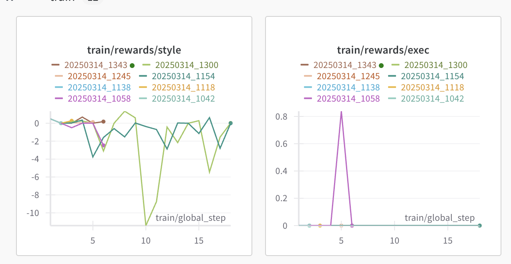

# Iteration 2. GRPO
 
03-12-2025

# Goal

Get a working plot of GRPO by tmw 1pm. 22h left.

## Motivation

Iteration 1 too slow. No time to rejection sample dataset at scale (DeepSeek providers too slow, healing is work). Skip SFT to direct 2.5 as baseline.
1. 2.5 baseline on self-hosted vLLM, plugged into Provider subclass.
2. Give multi-tool calling, can it heal?
3. Start GRPO regardless of "health". Will collect SFT later (detour).
4. Start 224n (need 10h) or poster design.

## Development

## TODO (Ordered)

> Commit by TODO done. Budget 8h total.

A. Code Interpreter.
> 2h/14 = 9m each.
- [x] Move `dsl` in src. Has file import issues. 40m 6:20pm
- [x] Refactor devtools debug -> tracer.
- [x] Script tasks as JSONL no test/sol split. 2am
- [x] Aggregate load of task/DSL funcs/type signatures/etc into core, tested util. 2am
- [x] MVP1: func(io) trace 1 string literal func
- [x] MVP2: func(io) trace of any solver_* in Typer (WIP)
- [/] vardiff is purefunc of DSLFunctionCall in new `differ.py`
- [x] Fuse types in dsl,src.
- [x] -> vardiff w any grid view
- [x] Good dataclass format of tracer stats
- [x] MVP3: vardiff trace of any solver_*
- [x] MVP4: trace any DSL fp w dataclass stats in JSON file
- [x] MVP5: choice of arbitrary formatter for prompt iter
- [/] Bonus: Live shell interpreter w `load(task)`, `dump(stats)`, `clear`, `help`, `man(func)`
  
B. sLM Baseline 8pm (7am)
> 2h/16 = 8m each.
- [x] Github find vLLM script for 2.5B, 1xA100.
- [/] Batch gen on same input
- [x] ngrok API w OpenAI-mocked interface
- [x] Override Provider `complete` for raw arequests
- [x] MVP1: Prompt 'Hello world' from local
- [x] Sanitize `evolutionary` prompts to call DSL
- [x] Good grid format for id.
- [x] MVP2: Prompt sLM to o DSL literal
- [x] ```py format reward 
- [x] Pipe to tempfile, use A.MVP4
- [ ] MVP3: 1 <tool_response> from gen vLLM
- [x] Reward dataclass: format, compile, % per example, n correct. Weighted method `score()` 
- [ ] Prompt sLM to rethink from tool call
- [ ] MVP4: Better 2nd tool call
- [ ] Bonus: Stats of non-DSL libs (list, count, group)
- [ ] MVP5: Solve easy task eventually w tool iter

C. GRPO Training Run
> Good [unsloth](https://docs.unsloth.ai/basics/reasoning-grpo-and-rl), [verifier](https://github.com/willccbb/verifiers/blob/main/verifiers/envs/code_env.py) articles

> Broad idea: Refactor local caller exec, remote vLLM gen -> local vLLM trajectories on cuda:0, Dataset Generator on cpu, halt on ```py to cpu code interpreter; cuda:1-3 is backprop. Rest follows open-r1.

Fri 2am, GRPO training runs on 1xH100, Qwen 7B.

Open-R1 sources good code [repos](https://github.com/huggingface/open-r1/issues/28), [e2b sandbox](https://e2b.dev/) would've been lifesaver earlier (no manual code interpreter?), and [Carlo](https://e2b.dev/) used RLHF?

Need to trace GPU to find if parallelism is done or possible.

Model chose (iter 0) to hide imports in func def and spam import (got stuck). Should add huge repetition penalty:
```
    from typing import Callable, Optional, Dict, List, Tuple, Dict, List, Tuple, Optional
    from typing import Callable, Optional, Dict, List, Tuple, Dict, List, Tuple, Optional
    from typing import Callable, Optional, Dict, List, Tuple, Dict, List, Tuple, Optional
```

## Overnight Run 1


Exec reward is 0, and style is unstable?!

4 errors and few flaws stop my work.
- [x] tmux session killed by Lambda in routine garbage collection (after 4h) -- use [`jobs`](https://www.geeksforgeeks.org/process-control-commands-unixlinux/) instead. 
- [x] Python exception handler `log_badcode` itself throws errors -- regression pytest handler.
- [x] Gen 1300: Model gens `print(grid)`, interferes with print() pass tracer file.
    - Let root handler catch.

```
13478   File "/home/ubuntu/r1-arc/src/code_interpreter/execution.py", line 150, in run
13479     with open(tracefp, "r") as f:
13480          ^^^^^^^^^^^^^^^^^^
13481 OSError: [Errno 36] File name too long: '[[9, 9, 6, 8, 7, 8, 7, 8, 8, 7, 8, 2, 2, 4, 4, 7], [9, 6, 6, 6, 7, 1, 6, 1, 1, 6, 1, 6, 1, 6, 2, 6], [6, 1, 6, 8, 6, 6, 8, 7, 0, 6, 8, 2, 5, 1, 1, 2], [8, 6, 1, 1, 6, 2, 5, 0, 0, 7, 6, 2, 6, 4, 4, 3], [8, 9, 6, 6, 7, 1, 6, 2, 2, 5, 6, 8, 3, 3, 8, 7], [5, 5, 5, 8, 8, 5, 5, 6, 6, 9, 6, 6, 9, 6, 8, 8], [3, 9, 8, 1, 1, 1, 5, 5, 5, 9, 5, 5, 8, 6, 3, 9], [8, 6, 1, 1, 1, 1, 6, 6, 1, 1, 7, 7, 8, 6, 8, 7], [8, 8, 7, 7, 9, 9, 7, 0, 6, 6, 9, 9, 7, 0, 8, 8], [8, 8, 7, 7, 9, 9, 7, 0, 6, 6, 9, 9, 7, 0, 8, 8], [6, 6, 9, 9, 5, 5, 7, 7, 9, 9, 5, 5, 8, 8, 6, 6], [9, 6, 5, 5, 4, 4, 4, 4, 7, 7, 4, 4, 8, 8, 9, 9], [9, 6, 3, 3, 4, 4, 4, 4, 7, 7, 4, 4, 8, 8, 9, 9], [6, 6, 4, 4, 4, 4, 9, 9, 5, 5, 4, 4, 9, 9, 6, 6], [9, 9, 9, 9, 2, 2, 2, 2, 5, 5, 2, 2, 8, 8, 9, 9]]'
```

- [x] OOM at GRPO accum loss: alloc 6.75gb but 6.16gb free.
At `1338` and `1042`, also cause [cryptic](https://chatgpt.com/share/67d4b42a-95c8-800b-b7b8-94a465ff484f) errors: fast matmul `CUBLAS_STATUS_EXECUTION_FAILED` fails.
- Is Unsloth gradient checkpointing [open issue](https://github.com/unslothai/unsloth/issues/1744#issuecomment-2683953959), also has PyTorch kernel error. Hotfix by lowering gpu_memory_utilization.
```
1118: Tried to allocate 8.50 GiB. GPU 0 has a total capacity of 79.10 GiB of which 2.28 GiB is fre
1058: TypeError: unsupported operand type(s) for +: 'UnboundLocalError' and 'str'
```

**Flaws**

TODO!

1. No penalty for wrong syntax, clearly bullshit or hallucinated code. Select `TypeError`, `SyntaxError`, `ParserSyntaxError`

```
 ParserSyntaxError("tokenizer error: Closing parenthesis ')' does not match opening parenthesis '['",
 ```
2. Undefined vars: `NameError`, `AttributeError`, `ImportError`

**Design Idea Changes**
1. Bigger rewards for correct, bigger penalties for bad syntax. Should not climb local minima of format.
2. Guided [Regex](https://github.com/joerunde/vllm/blob/538517515027c496263b8d1846d7bc16c67e923f/tests/entrypoints/llm/test_guided_generate.py) grammars from vLLM stop bad guesses.
3. Better print markings. Now unclear if printout corresponds to which gen.
4. ARC-DSL's format test, x1...xn, no unused.

## Overnight Run 2

Meta-RL reward delta paper from HF

Cool GPU optimizations (prefix caching, backtrack stack by stack push/pop) in theory and in [vLLM](https://docs.vllm.ai/en/stable/design/automatic_prefix_caching.html#design-automatic-prefix-caching) forbidden by unsloth.
Unsloth unstable, less control.

trl doesn't support any kwargs for vLLM guided decoding. Should hotfix `.venv/lib/python3.12/site-packages/trl/trainer/grpo_trainer.py`.
CFG support tree: unsloth -> vllm -> outlines -> lark -> any CFG
- Lark grammars for guided vLLM dec not working. Continue when more time.

“Premature optimization is the root of all evil.”

### Run `v1-20250316_1050`
- Easy & medium (diff < 2) tasks only
- Cut prompt length, filter <30k tokens -- solves `CUBLAS_STATUS_EXECUTION_FAILED` illegal memory access.

## Guided CFG Grammars Progress
DSL CFG works in Lark but not for streaming. Validating a streaming CFG will be huge pain, abandoning.